# Nexus Product Vision

**Nexus** — a quiet, ultra-fast, single-user second brain that never gets in your way.

**Tagline:** "One place. Zero friction. Pure flow."

---

## Target User

40–55-year-old male software engineers and engineering leaders who:
- Live in terminals and browsers
- Hate bloated tools and unnecessary complexity
- Value speed, beauty, and reliability above all else
- Want a private, personal tool—no sharing, no teams, no collaboration overhead

## Core Promise

Every single interaction feels instantaneous and satisfying—while staying dead simple and 100% private.

---

## Product Principles

1. **Speed is non-negotiable** — Sub-100ms perceived latency on every action
2. **Keyboard mastery** — Discoverable shortcuts everywhere; Cmd+K is home base
3. **Defaults are correct** — Zero cognitive load; the app knows what you want
4. **Privacy first** — Individual-only, no sharing, no teams, all data synced securely
5. **Cohesive, not assembled** — One thoughtful tool, not four apps glued together

---

## Implementation Order

Features are built in this sequence to establish core infrastructure first, then layer capabilities:

### Phase 1: Foundation
Establish the application shell, navigation patterns, and core infrastructure that all features depend on.

### Phase 2: Calendar
Calendar is first because it provides the temporal backbone—everything else relates to time.

### Phase 3: Tasks
Tasks builds on the time infrastructure and introduces the Kanban interaction pattern used elsewhere.

### Phase 4: Reminders
Simpler than tasks, but requires the notification infrastructure that benefits from earlier learnings.

### Phase 5: Notes
Notes is the most standalone feature and can integrate with earlier features once they exist.

### Phase 6: Integration
The Unified Agenda and cross-linking bring everything together into a cohesive experience.

---

## Feature Specifications

### 1. Calendar

#### 1.1 Views

| View | Description | Key Behaviors |
|------|-------------|---------------|
| **Day** | Vertical timeline for single day | Hour slots, current time indicator, events as blocks |
| **Week** | Horizontal timeline, 7 days | Same as Day but condensed, week number shown |
| **Month** | Traditional grid | Days as cells, events as colored dots or short text |
| **Year** | 12 mini-month grid | Quick navigation, month selection |
| **Agenda** | Chronological list | Unified with tasks/reminders (see Unified Agenda) |

#### 1.2 Event Properties

| Property | Required | Description |
|----------|----------|-------------|
| Title | Yes | Short descriptive name |
| Start | Yes | Date and time (or all-day start date) |
| End | Yes | Date and time (or all-day end date) |
| All-Day | No | Boolean toggle; hides time when true |
| Timezone | No | Dropdown; defaults to "Local time" (floating) |
| Recurrence | No | None / Daily / Weekly / Monthly / Yearly |
| Recurrence End | No | Never / After X occurrences / On specific date |
| Color | No | One of 12 semantic colors; defaults to Blue |
| Location | No | Free text |
| Notes | No | Markdown-supported text |

**Floating Time Behavior:**
When timezone is "Local time" (floating), the event displays at the same local time regardless of the user's current timezone. Example: "7am workout" shows as 7am whether user is in New York or Tokyo. Ideal for habits and routines.

#### 1.3 Calendar Interactions

| Interaction | Behavior |
|-------------|----------|
| Double-click empty slot | Opens quick-add bar at that time |
| Drag event vertically | Changes start/end time; live tooltip shows new time |
| Drag event horizontally | Changes date |
| Drag event edge | Resizes duration |
| Click event | Opens event detail/edit modal |
| Press `t` | Snaps to Today with subtle zoom animation |
| Press `Cmd+N` | Opens new event modal |

#### 1.4 Calendar Use Cases

**UC-CAL-01: Quick Navigation**
- User opens Calendar
- User presses `t`
- View snaps to current day in Day view

**UC-CAL-02: Natural Language Event Creation**
- User presses `Cmd+K`
- User types "Lunch tomorrow 1pm floating green"
- Event appears on tomorrow at 1pm, floating timezone, green color

**UC-CAL-03: Reschedule via Drag**
- User views Week view
- User drags event from Monday to Wednesday
- Event moves immediately (optimistic)
- Tooltip shows "Wed, Dec 18" during drag

**UC-CAL-04: Create Recurring Event**
- User double-clicks time slot
- User types "Standup" and sets recurrence to "Weekly, Monday"
- Event appears on all Mondays
- User sees recurrence icon on event

**UC-CAL-05: Modify Single Instance of Recurring Event**
- User clicks on one instance of recurring event
- User modifies the time
- System prompts: "Edit this event only, or all future events?"
- User selects "This event only"
- Only that instance changes; others remain

**UC-CAL-06: Resize Event Duration**
- User hovers over bottom edge of event block
- Cursor changes to resize indicator
- User drags down
- Event end time extends; tooltip shows new duration

---

### 2. Tasks

#### 2.1 Kanban Columns

Four fixed columns representing task lifecycle:

| Column | Purpose | Behavior |
|--------|---------|----------|
| **Backlog** | Tasks not yet started | Default landing for new tasks |
| **In Progress** | Tasks being worked on | Limited WIP encouraged (visual density) |
| **Completed** | Recently finished tasks | Shows completion animation |
| **Archived** | Historical record | Auto-populated after 24h; hidden by default |

**Auto-Archive Behavior:**
- Completed tasks automatically move to Archived after 24 hours
- This can be disabled in Settings
- Archived tasks are hidden from board but searchable

#### 2.2 Task Properties

| Property | Required | Description |
|----------|----------|-------------|
| Title | Yes | Short descriptive name |
| Description | No | Markdown-supported text |
| Status | Yes | Backlog / In Progress / Completed / Archived |
| Priority | No | 1 (highest) through 5 (lowest) |
| Effort | No | Fibonacci: 1, 2, 3, 5, 8, 13, 21, 34, 55, 89 |
| Due Date | No | Date and optional time |
| Planned Start | No | Date and optional time |
| Labels | No | Free text tags; auto-suggest from existing |
| Note Links | No | References to Notes (via # syntax) |

**Priority Visualization:**
- P1: Red vertical bar (3px left border)
- P2: Orange vertical bar
- P3: Amber vertical bar
- P4: Yellow vertical bar
- P5: Gray vertical bar

#### 2.3 Task Views

**Kanban Board (Default):**
- Four columns side-by-side
- Cards show: title, due date (if set), effort badge, label chips
- Column headers show count badge
- Drag cards between columns

**List View (Table):**
| Column | Sortable | Filterable |
|--------|----------|------------|
| Priority | Yes | Yes (show P1 only, etc.) |
| Title | Yes (alpha) | Yes (search) |
| Due | Yes | Yes (overdue, no due date, etc.) |
| Start | Yes | Yes (has start date) |
| Effort | Yes | Yes (range) |
| Labels | No | Yes (has label X) |
| Actions | No | No |

**Multi-Sort:** Click column headers in sequence to apply secondary sort. Example: Click "Due" then "Priority" to sort by due date, then by priority within each due date.

#### 2.4 Task Interactions

| Interaction | Behavior |
|-------------|----------|
| Drag card between columns | Status changes immediately; card animates |
| Press `Space` on selected task | Toggles Completed status |
| Press `Cmd+T` anywhere | Opens quick-add task modal |
| Click + at column bottom | Inline quick-add in that column |
| Press `e` on selected task | Opens edit modal |
| Press `d` or `Backspace` | Deletes task (with confirmation) |

#### 2.5 Task Use Cases

**UC-TASK-01: Quick Task Creation with Properties**
- User presses `Cmd+T`
- User types "Refactor auth 5pts due Friday p1 #security"
- Task appears in Backlog with:
  - Title: "Refactor auth"
  - Effort: 5
  - Due: Next Friday
  - Priority: 1
  - Labels: security

**UC-TASK-02: Move Task to In Progress**
- User views Kanban board
- User drags task from Backlog to In Progress
- Card rotates 4° during drag
- Card drops with shadow animation
- Status updates immediately

**UC-TASK-03: Complete Task via Keyboard**
- User navigates to task using `j`/`k`
- User presses `Space`
- Checkbox animates to checked
- Card slides to Completed column

**UC-TASK-04: Filter Overdue Tasks**
- User switches to List view
- User clicks "Overdue" filter chip
- Only tasks with due date before today appear
- Overdue badge shown in red

**UC-TASK-05: Multi-Sort by Urgency**
- User views List view
- User clicks "Due" column header
- Tasks sort by due date ascending
- User clicks "Priority" column header
- Tasks now sorted by due date, then by priority within each date

**UC-TASK-06: Inline Quick-Add**
- User clicks "+" at bottom of In Progress column
- Input field appears inline
- User types "Review PR #security"
- Presses Enter
- Task appears in In Progress with label "security"

---

### 3. Reminders

#### 3.1 Reminder Properties

| Property | Required | Description |
|----------|----------|-------------|
| Title | Yes | Short descriptive name |
| Date/Time | Yes | Exact moment to fire (floating by default) |
| Note | No | Markdown-supported text |
| Color | No | One of 12 semantic colors |
| Snoozed Until | No | If snoozed, next fire time |

#### 3.2 Reminder Behaviors

**Notification Trigger:**
- At exact date/time, browser notification appears
- Subtle audio chime plays
- Reminder highlighted in Agenda view

**Snooze Options:**
When notification appears, user can:
- Mark Done (removes from Agenda)
- Snooze 10 minutes
- Snooze 1 hour
- Snooze until tomorrow 9am
- Snooze custom (opens picker)

**Calendar Integration:**
- Reminders appear as banners in Calendar Day/Week views
- Distinguished from events by bell icon
- Clicking opens reminder detail

#### 3.3 Reminder Use Cases

**UC-REM-01: Create Reminder via Command Palette**
- User presses `Cmd+K`
- User types "! Call dentist tomorrow 3pm"
- Reminder created for tomorrow at 3pm

**UC-REM-02: Receive and Complete Reminder**
- Time reaches reminder's date/time
- Browser notification appears with title
- Subtle chime plays
- User clicks notification
- App opens to Agenda with reminder highlighted
- User presses `Space` to mark done
- Reminder fades from Agenda

**UC-REM-03: Snooze Reminder**
- Reminder notification appears
- User clicks "Snooze 1 hour"
- Reminder disappears from notification
- Reminder reappears in 1 hour
- Snoozed indicator shown in Agenda

**UC-REM-04: View Reminders in Calendar**
- User views Calendar Week view
- Reminders appear as banner items at their scheduled time
- Bell icon distinguishes from events
- Clicking opens reminder for edit

---

### 4. Notes

#### 4.1 Note Properties

| Property | Required | Description |
|----------|----------|-------------|
| Title | Yes | Large, bold heading |
| Body | No | Markdown with live preview toggle |
| Color | No | One of 12 semantic colors (soft wash background) |
| Tags | No | Free text pills for categorization |
| Pinned | No | Boolean; pinned notes appear first |
| Archived | No | Boolean; soft delete, hidden but searchable |

#### 4.2 Note Views

**Grid View (Default):**
- 3-5 columns depending on viewport width
- Cards show: title, body preview (3-4 lines), tags
- Background tinted with note color
- Pinned notes always at top

**List View:**
- Single column, full-width cards
- More body preview visible
- Same sorting as Grid

#### 4.3 Markdown Support

| Feature | Syntax |
|---------|--------|
| Headings | `# H1`, `## H2`, `### H3` |
| Bold | `**text**` |
| Italic | `*text*` |
| Links | `[text](url)` |
| Lists | `- item` or `1. item` |
| Code | `` `inline` `` or fenced blocks |
| Blockquotes | `> quote` |
| Horizontal rule | `---` |

**Preview Toggle:**
- Edit mode: Plain textarea with Markdown syntax visible
- Preview mode: Rendered HTML, same typography as rest of app
- Toggle button appears top-right of body field

#### 4.4 Note Interactions

| Interaction | Behavior |
|-------------|----------|
| `Cmd+Shift+N` | Create new note; title field focused |
| Press `Enter` in title | Cursor moves to body |
| Click pin icon | Toggles pinned status; note moves to top |
| Press `e` on selected note | Opens edit modal |
| Press `d` or `Backspace` | Archives note (soft delete) |

#### 4.5 Note Use Cases

**UC-NOTE-01: Quick Note Creation**
- User presses `Cmd+Shift+N`
- Modal opens with title field focused
- User types "2026 Architecture"
- User presses `Enter`
- Cursor moves to body
- User types Markdown content
- Clicks Preview toggle to see rendered output

**UC-NOTE-02: Pin Important Note**
- User views Notes grid
- User hovers over note card
- Pin icon appears
- User clicks pin
- Note animates to top of grid
- Pin icon shows filled state

**UC-NOTE-03: Search and Find Archived Note**
- User presses `Cmd+K`
- User types "meeting notes"
- Search results include archived notes (marked with archive icon)
- User clicks archived note
- Note opens in view mode
- User can unarchive from modal

**UC-NOTE-04: Color-Code Notes**
- User opens note for edit
- User clicks color picker
- 12 color options shown
- User selects Green
- Note background tints with soft green wash
- Color persists across views

---

### 5. Unified Agenda / Home

The Home view is the first screen users see. It shows a chronological timeline of everything happening now and in the coming days.

#### 5.1 Agenda Structure

```mermaid
graph TB
    subgraph Today
        A[9:00 - Team Standup<br/>📅 Event]
        B[10:00 - Overdue: Finish API spec<br/>✓ Task, P1]
        C[3:00 - Call dentist<br/>🔔 Reminder]
    end
    subgraph Tomorrow
        D[All Day - Project deadline<br/>📅 Event]
        E[2:00 - Review PR<br/>✓ Task]
    end
    subgraph "Next 7 Days"
        F[...]
    end
    Today --> Tomorrow --> F
```

#### 5.2 Items Shown

| Item Type | When Shown | Visual Indicator |
|-----------|------------|------------------|
| Events | On their scheduled date/time | Color bar on left, calendar icon |
| Tasks | Due today/tomorrow, or overdue | Checkbox, priority bar |
| Tasks | Planned start today/tomorrow | Checkbox, "starts" label |
| Reminders | Firing today/tomorrow | Bell icon, checkbox |

#### 5.3 Agenda Behaviors

**Scrolling:**
- Starts at current day/time
- Scrolls infinitely into future
- Past items collapse after 24 hours

**Quick Actions:**
- `Space` on task/reminder toggles complete
- `Enter` opens item detail
- `←` / `→` jumps to previous/next day

**Overdue Highlighting:**
- Overdue tasks shown with red background tint
- "Overdue" badge visible
- Sorted to top of their section

#### 5.4 Agenda Use Cases

**UC-AGENDA-01: Morning Review**
- User opens Nexus at 8:30am
- Home view shows:
  - 9:00am: Standup (blue event)
  - 10:00am: Overdue task with red badge
  - 3:00pm: Reminder with bell icon
- User scans and plans their day

**UC-AGENDA-02: Complete Task from Agenda**
- User sees overdue task in Agenda
- User presses `j` to navigate to it
- User presses `Space`
- Task checkbox animates
- Task fades from Agenda (moves to Completed)

**UC-AGENDA-03: Snooze Reminder from Agenda**
- Reminder fires at 3pm
- User sees highlighted reminder in Agenda
- User clicks snooze dropdown
- User selects "Tomorrow 9am"
- Reminder disappears from today, appears tomorrow

---

### 6. Cross-Linking System

Items can reference each other using special syntax in any Markdown field.

#### 6.1 Link Syntax

| Syntax | Links To | Example |
|--------|----------|---------|
| `#` + title | Note | `See #Architecture Decisions` |
| `@` + title | Task | `Blocked by @Refactor auth` |
| `!` + title | Event or Reminder | `Discussed in !Team standup` |

#### 6.2 Autocomplete Behavior

When user types trigger character (`#`, `@`, `!`):
- Dropdown appears with matching items
- Fuzzy search filters as user continues typing
- Arrow keys navigate dropdown
- Enter inserts selected link
- Escape closes dropdown without inserting

#### 6.3 Link Rendering

- Links render as clickable pills
- Pill shows item title (truncated if long)
- Clicking navigates to linked item
- Hover shows preview tooltip

#### 6.4 Cross-Link Use Cases

**UC-LINK-01: Link Note from Task**
- User edits task description
- User types "See design notes #"
- Dropdown shows all notes
- User types "UI" to filter
- User selects "UI Mockups" note
- Link appears as clickable pill: `#UI Mockups`

**UC-LINK-02: Link Task from Note**
- User edits note body
- User types "Related: @Refactor"
- Dropdown shows matching tasks
- User selects "Refactor auth"
- Link appears as pill: `@Refactor auth`

**UC-LINK-03: Navigate via Link**
- User views task with `#Architecture` link
- User clicks the link pill
- App navigates to Architecture note
- Back button returns to task

---

### 7. Global Search

Search finds items across all types (events, tasks, reminders, notes).

#### 7.1 Search Access

- `Cmd+K` opens Command Palette (includes search)
- `Cmd+F` opens dedicated search for current view
- `/` focuses search input (global)

#### 7.2 Search Behavior

- Searches: titles, descriptions, notes, locations, labels, tags
- Fuzzy matching with typo tolerance
- Results grouped by type
- Recent searches remembered

#### 7.3 Search Results

| Group | Sort Order |
|-------|------------|
| Actions | Relevance |
| Navigation | Static order |
| Events | Date (upcoming first) |
| Tasks | Priority, then due date |
| Reminders | Date (upcoming first) |
| Notes | Last modified |

#### 7.4 Search Use Cases

**UC-SEARCH-01: Find Task by Label**
- User presses `Cmd+K`
- User types "#security"
- Results show all tasks/notes with security label
- User clicks desired task
- Task opens in detail view

**UC-SEARCH-02: Find Past Event**
- User presses `Cmd+K`
- User types "standup december"
- Results show Team Standup events from December
- User clicks to view event details

---

### 8. Settings & Preferences

#### 8.1 User Preferences

| Setting | Options | Default |
|---------|---------|---------|
| Timezone | Auto (browser) / Manual selection | Auto |
| Theme | Light / Dark / Auto (follows OS) | Auto |
| Calendar time increment | 10 / 15 / 30 / 60 minutes | 15 |
| Default event duration | 15 / 30 / 45 / 60 minutes | 30 |
| Auto-archive completed tasks | Enabled / Disabled | Enabled (24h) |
| Reduced motion | Enabled / Disabled | System preference |
| Notification sound | Enabled / Disabled | Enabled |
| Start of week | Sunday / Monday | Sunday |

#### 8.2 Settings Access

- `Cmd+,` opens Settings modal
- Settings icon in sidebar (bottom)
- Organized in sections: General, Calendar, Tasks, Notifications

---

## Success Criteria

| Metric | Target |
|--------|--------|
| Any interaction to visual feedback | < 50ms |
| Time to create task (keyboard) | < 3 seconds |
| Time to create event (drag) | < 2 seconds |
| Time to first meaningful paint | < 1.5 seconds |
| Works fully offline | Yes |
| Cross-tab sync delay | < 500ms |

---

## Related Documents

- **DESIGN_GUIDELINES.md** — Complete UX, UI, and interaction specifications

---

*When complete, Nexus will feel like one thoughtful tool instead of four apps glued together. Same color language, same Markdown renderer, same creation patterns, same keyboard shortcuts, same micro-interactions. Nothing bolted on. Everything cohesive.*

---

## New Features

### Google Calendar Import

Import events from Google Calendar into Nexus with incremental sync and conflict detection.

#### Overview

Users can connect their Google account via OAuth 2.0 and import calendar events from their primary Google Calendar. Subsequent imports only fetch changed events (incremental sync). If a previously imported event was modified locally in Nexus, it is flagged as a conflict and not overwritten.

#### Authentication

| Component | Description |
|-----------|-------------|
| **OAuth 2.0 Flow** | User clicks "Connect Google Calendar" → redirected to Google login → grants `calendar.readonly` scope → receives access/refresh tokens |
| **Token Storage** | Encrypted tokens stored in USER_META entity |
| **Token Refresh** | Automatic refresh when access token expires (1 hour lifetime) |
| **Disconnect** | User can revoke access; tokens deleted from database |

#### Settings UI (Integrations Section)

Located in `/settings` page under new "Integrations" section:

| Element | Description |
|---------|-------------|
| **Google Calendar Card** | Shows connection status (Connected/Not Connected) |
| **Connect Button** | Initiates OAuth 2.0 flow (hidden when connected) |
| **Connected Account** | Shows Google email when connected |
| **Import Button** | "Import from Google Calendar" - triggers import |
| **Disconnect Button** | Revokes access and removes tokens |
| **Last Sync** | Timestamp of last successful import |

#### Import Behavior

**First Import:**
- Fetches all events from primary calendar (past 1 year, future 2 years)
- Creates EVENT/MASTER/INSTANCE entities in Nexus
- Stores Google event ID (`googleEventId`) and sync timestamp (`googleSyncedAt`)
- Stores Google etag for change detection (`googleEtag`)

**Incremental Import (Subsequent):**
- Uses `syncToken` from Google API to fetch only changed events
- Compares each event against local version:
  - If local event unchanged since import → update with Google data
  - If local event was modified → flag as conflict, do NOT overwrite

**Recurring Events:**
- Google recurring events imported as MASTER entity with RRULE
- Individual modified instances imported as INSTANCE entities
- Exception dates (EXDATE) preserved

#### Conflict Detection

A conflict occurs when:
1. Event was previously imported from Google (has `googleEventId`)
2. Event was modified locally in Nexus after import (`updatedAt > googleSyncedAt`)
3. Google version has also changed (different etag)

**Conflict Resolution:**
- Conflicting events are NOT automatically updated
- Conflicts collected and shown to user in results modal
- User can manually resolve conflicts later (future enhancement)

#### Sync Metadata Fields (EVENT Entity)

| Field | Type | Description |
|-------|------|-------------|
| `googleEventId` | String | Google Calendar event ID |
| `googleCalendarId` | String | Google Calendar ID (primary) |
| `googleSyncedAt` | ISO8601 | Timestamp when event was last synced from Google |
| `googleEtag` | String | Google's etag for change detection |

#### Notification System

A general-purpose notification system persisted in the database.

**NOTIFICATION Entity:**

| Field | Type | Description |
|-------|------|-------------|
| `notificationId` | String | Unique ID (ULID) |
| `userId` | String | Owner |
| `type` | Enum | `GOOGLE_IMPORT`, `REMINDER_DUE`, `TASK_OVERDUE`, etc. |
| `title` | String | Short notification title |
| `message` | String | Notification body |
| `status` | Enum | `UNREAD`, `READ`, `DISMISSED` |
| `metadata` | JSON | Type-specific data (import counts, conflict list, etc.) |
| `createdAt` | ISO8601 | When notification was created |
| `readAt` | ISO8601 | When user read the notification |

**Notification UI:**

| Element | Location | Description |
|---------|----------|-------------|
| **Bell Icon** | Sidebar (bottom section) | Shows notification list |
| **Unread Badge** | On bell icon | Red dot when unread notifications exist |
| **Notification Menu** | Dropdown from bell icon | Lists all notifications |
| **Notification Item** | In menu | Title, time, click to view details |

**Google Import Notification:**

When import completes, a notification is created with:
- Type: `GOOGLE_IMPORT`
- Title: "Google Calendar Import Complete"
- Message: Summary of results
- Metadata: `{ imported: N, skipped: N, conflicts: [...] }`

Clicking the notification opens a modal showing:
- Number of events imported
- Number of events skipped (unchanged)
- List of conflicts (event title, local vs Google change dates)

#### Use Cases

**UC-GCAL-01: Connect Google Calendar**
1. User navigates to Settings → Integrations
2. User clicks "Connect Google Calendar"
3. User redirected to Google OAuth consent screen
4. User grants calendar.readonly permission
5. User redirected back to Nexus
6. Settings shows "Connected" with Google email

**UC-GCAL-02: First Import**
1. User clicks "Import from Google Calendar"
2. Loading indicator shown
3. Events fetched from Google primary calendar
4. Events created in Nexus database
5. Notification created with results
6. Bell icon shows red badge
7. User clicks bell → sees import notification
8. User clicks notification → modal shows: "42 events imported, 0 conflicts"

**UC-GCAL-03: Incremental Import with Conflicts**
1. User modified "Team Standup" event locally (changed time)
2. Someone also modified same event in Google Calendar
3. User clicks "Import from Google Calendar"
4. Import runs, detects conflict on "Team Standup"
5. Event NOT updated (local changes preserved)
6. Notification shows: "15 events imported, 1 conflict"
7. Modal lists conflict: "Team Standup - modified locally Nov 25, Google changed Nov 26"

**UC-GCAL-04: Disconnect Google Calendar**
1. User clicks "Disconnect" in Settings
2. Confirmation dialog appears
3. User confirms
4. OAuth tokens deleted from database
5. Status shows "Not Connected"
6. Previously imported events remain in Nexus (not deleted)

#### API Endpoints

| Method | Endpoint | Description |
|--------|----------|-------------|
| `GET` | `/oauth/google/authorize` | Returns Google OAuth authorization URL |
| `POST` | `/oauth/google/callback` | Exchanges auth code for tokens |
| `DELETE` | `/oauth/google/revoke` | Revokes Google access and deletes tokens |
| `POST` | `/users/:userId/google-calendar/import` | Triggers import from Google Calendar |
| `GET` | `/users/:userId/google-calendar/status` | Returns connection status and last sync time |
| `GET` | `/users/:userId/notifications` | List user's notifications |
| `PATCH` | `/users/:userId/notifications/:id` | Update notification (mark read/dismissed) |
| `DELETE` | `/users/:userId/notifications/:id` | Delete notification |

#### Success Criteria

| Metric | Target |
|--------|--------|
| OAuth flow completion | < 10 seconds |
| First import (100 events) | < 5 seconds |
| Incremental import | < 2 seconds |
| Conflict detection accuracy | 100% |
| Notification delivery | Immediate (< 100ms after import completes) |
