# Nexus Design Guidelines

A comprehensive UX, UI, and interaction specification for building a high-performance personal productivity application.

---

## 1. Design Philosophy

### 1.1 Core Thesis: Speed as the Primary Constraint

Every decision in Nexus—from rendering to color choices—serves the user's perception of speed. The application operates on strict latency imperatives:

| Threshold | User Perception | Target |
|-----------|-----------------|--------|
| < 50ms | Instantaneous—user feels they caused the action | Primary target for all interactions |
| < 100ms | Fast—acceptable for complex operations | Hard ceiling for any user-initiated action |
| > 100ms | Delayed—breaks flow state | Never acceptable |

### 1.2 The Utilitarian Instrument

Nexus is a precision instrument for serious work:

- **Density over decoration**: Every pixel earns its place
- **Speed over features**: A fast, focused tool beats a slow, comprehensive one
- **Keyboard mastery over mouse convenience**: Power users achieve flow through muscle memory
- **Local availability over cloud dependency**: The network is for sync, not for permission

### 1.3 Design Principles (Non-Negotiable)

1. **Sub-100ms perceived latency** on every action—no exceptions
2. **Keyboard-first interaction**—every action achievable without a mouse
3. **Zero cognitive load**—defaults are always correct
4. **Visual calm**—content is king, chrome is invisible
5. **Engineered aesthetic**—professional severity, not playful softness

---

## 2. Interaction Behaviors

### 2.1 Optimistic Updates

The interface anticipates success and updates immediately. Users should never wait for network confirmation before seeing their action reflected.


**Rules:**
- Never show spinners for: archive, delete, complete, move, star, or any mutation
- Spinners permitted only for: initial data load, file uploads, AI generation
- Rollback must restore exact previous state with subtle notification

### 2.2 Offline Behavior

The application must function completely offline:

- All features work without network connection
- Changes queue locally and sync when connection restores
- Sync status indicator shows current state (syncing / synced / offline)
- No error states block user interaction

### 2.3 Real-Time Sync

When online, changes sync across all open tabs and devices instantly:

- Primary method: persistent connection for instant push
- Fallback: polling when persistent connection unavailable
- Conflict resolution: most recent change wins (by timestamp)

---

## 3. Visual Design System

### 3.1 Color System

Colors use perceptually uniform color space—colors with the same lightness value appear equally bright regardless of hue.

#### Dark Theme (Default)

| Token | Value | Usage |
|-------|-------|-------|
| `--bg-base` | `#0f172a` | Primary background |
| `--bg-surface` | `#1e293b` | Elevated panels, cards |
| `--bg-elevated` | `#334155` | Hover states, active items |
| `--text-primary` | `#f8fafc` | Headings, primary content |
| `--text-secondary` | `#94a3b8` | Labels, metadata |
| `--text-muted` | `#64748b` | Placeholders, disabled |
| `--accent-primary` | `#3b82f6` | Primary actions, focus rings |
| `--accent-hover` | `#2563eb` | Hover state for accents |
| `--border-subtle` | `rgba(148, 163, 184, 0.1)` | Separators, dividers |
| `--border-visible` | `rgba(148, 163, 184, 0.2)` | Card borders, inputs |

#### Light Theme

| Token | Value | Usage |
|-------|-------|-------|
| `--bg-base` | `#ffffff` | Primary background |
| `--bg-surface` | `#f8fafc` | Elevated panels, cards |
| `--bg-elevated` | `#f1f5f9` | Hover states, active items |
| `--text-primary` | `#0f172a` | Headings, primary content |
| `--text-secondary` | `#475569` | Labels, metadata |
| `--text-muted` | `#94a3b8` | Placeholders, disabled |
| `--accent-primary` | `#2563eb` | Primary actions, focus rings |
| `--accent-hover` | `#1d4ed8` | Hover state for accents |
| `--border-subtle` | `rgba(15, 23, 42, 0.06)` | Separators, dividers |
| `--border-visible` | `rgba(15, 23, 42, 0.12)` | Card borders, inputs |

#### 12-Color Semantic Palette

Used consistently across all features (events, tasks, labels, notes):

| Name | Dark Mode | Light Mode | Semantic Usage |
|------|-----------|------------|----------------|
| Slate | `#64748b` | `#475569` | Default, neutral |
| Red | `#ef4444` | `#dc2626` | Overdue, urgent, P1 |
| Orange | `#f97316` | `#ea580c` | Warning, P2 |
| Amber | `#f59e0b` | `#d97706` | Attention, P3 |
| Yellow | `#eab308` | `#ca8a04` | Highlight |
| Lime | `#84cc16` | `#65a30d` | Success, complete |
| Green | `#22c55e` | `#16a34a` | Active, in-progress |
| Teal | `#14b8a6` | `#0d9488` | Info |
| Cyan | `#06b6d4` | `#0891b2` | Links |
| Blue | `#3b82f6` | `#2563eb` | Primary accent |
| Violet | `#8b5cf6` | `#7c3aed` | Special |
| Pink | `#ec4899` | `#db2777` | Personal |

### 3.2 Typography

**Font Stack (System Fonts):**

```css
font-family: 
  ui-sans-serif, 
  system-ui, 
  -apple-system, 
  BlinkMacSystemFont, 
  "Segoe UI", 
  Roboto, 
  "Helvetica Neue", 
  Arial, 
  sans-serif;
```

**Rationale:** Zero network latency, native OS feel, premium appearance with proper kerning.

**Type Scale:**

| Token | Size | Weight | Line Height | Usage |
|-------|------|--------|-------------|-------|
| `--text-xs` | 11px | 400 | 1.4 | Badges, timestamps |
| `--text-sm` | 13px | 400 | 1.5 | Secondary text, metadata |
| `--text-base` | 14px | 400 | 1.6 | Body text, inputs |
| `--text-md` | 15px | 500 | 1.5 | List items, buttons |
| `--text-lg` | 18px | 600 | 1.4 | Section headers |
| `--text-xl` | 22px | 600 | 1.3 | Page titles |
| `--text-2xl` | 28px | 700 | 1.2 | Hero text |

**Monospace (for code, timestamps):**

```css
font-family: 
  ui-monospace, 
  SFMono-Regular, 
  "SF Mono", 
  Menlo, 
  Consolas, 
  monospace;
```

### 3.3 Spacing System

**Dual-Grid System:**

- **Macro spacing (8px base):** Margins, section gaps, card spacing
- **Micro spacing (4px base):** Internal padding, icon gaps, dense components

| Token | Value | Usage |
|-------|-------|-------|
| `--space-1` | 4px | Icon-label gaps, tight padding |
| `--space-2` | 8px | Input padding, list item gaps |
| `--space-3` | 12px | Card internal padding |
| `--space-4` | 16px | Section gaps |
| `--space-5` | 20px | Large component padding |
| `--space-6` | 24px | Panel margins |
| `--space-8` | 32px | Section margins |
| `--space-10` | 40px | Page padding |
| `--space-12` | 48px | Major section breaks |

**Density Targets:**

- Sidebar items: 32px row height
- List rows: 36px row height
- Table rows: 40px row height
- Cards: 12px internal padding

### 3.4 Border Radius

**Constraint:** Maximum 3px radius. Corners must remain subtle and professional.

| Token | Value | Usage |
|-------|-------|-------|
| `--radius-none` | 0 | Sharp edges where needed |
| `--radius-sm` | 2px | Buttons, inputs, badges |
| `--radius-md` | 3px | Cards, modals, dropdowns |

**Forbidden:** Any radius > 3px

### 3.5 Shadows and Depth

**Dark Mode Depth Strategy:**

In dark themes, elevated surfaces are *lighter*, not darker. Shadows are subtle and combined with inner highlights for a "cut glass" effect.

**Light Mode Depth:**

Standard shadow hierarchy with subtle, diffuse shadows.

---

## 4. Keyboard-First Interaction

### 4.1 Shortcut Philosophy

The keyboard is the primary input method. Every action must be achievable without a mouse. Shortcuts should be:

- **Discoverable:** Shown in menus, tooltips, and command palette
- **Memorable:** Follow common conventions (Vim-style navigation, standard OS shortcuts)
- **Consistent:** Same shortcut patterns across all views

### 4.2 Global Shortcuts

| Shortcut | Action |
|----------|--------|
| `Cmd/Ctrl + K` | Open command palette (primary navigation) |
| `Cmd/Ctrl + N` | New event (in calendar context) |
| `Cmd/Ctrl + T` | New task |
| `Cmd/Ctrl + Shift + N` | New note |
| `Cmd/Ctrl + /` | Show keyboard shortcuts |
| `Cmd/Ctrl + ,` | Open settings |
| `Cmd/Ctrl + F` | Search current view |
| `Esc` | Close modal / Go back |
| `?` | Show contextual help |

### 4.3 Navigation Shortcuts

| Shortcut | Action |
|----------|--------|
| `g` then `h` | Go to Home/Agenda |
| `g` then `c` | Go to Calendar |
| `g` then `t` | Go to Tasks |
| `g` then `r` | Go to Reminders |
| `g` then `n` | Go to Notes |
| `t` | Jump to Today (in calendar) |

### 4.4 List Navigation (Vim-style)

| Shortcut | Action |
|----------|--------|
| `j` / `↓` | Next item |
| `k` / `↑` | Previous item |
| `Enter` | Open selected item |
| `Space` | Toggle complete (tasks/reminders) |
| `e` | Edit selected item |
| `Backspace` / `d` | Delete selected item |
| `m` | Move to... (opens picker) |

### 4.5 Calendar-Specific

| Shortcut | Action |
|----------|--------|
| `←` / `→` | Previous/Next day |
| `↑` / `↓` | Previous/Next week (in week view) |
| `1` | Day view |
| `2` | Week view |
| `3` | Month view |
| `4` | Year view |
| `5` | Agenda view |

---

## 5. Command Palette

The command palette is the central hub of Nexus. It unifies navigation, actions, and search.

### 5.1 Behavior

- Available from any screen via `Cmd/Ctrl + K`
- Input auto-focused on open
- Previous focus restored on close
- Context-aware: prioritizes actions relevant to current view

### 5.2 Search Behavior

- Fuzzy matching with typo tolerance (e.g., "calndr" matches "Calendar")
- Results weighted by: recency > frequency > relevance
- Non-contiguous character matching (e.g., "nts" matches "Notes")

### 5.3 Result Groups

Results appear in this order:
1. **Actions** — Things you can do now (Create task, Archive, etc.)
2. **Navigation** — Places to go (Calendar, Tasks, etc.)
3. **Recent Items** — Recently viewed/edited items
4. **Search Results** — Matching tasks, events, notes, reminders

### 5.4 Educational Design

Every result shows its keyboard shortcut (if available) to teach users faster methods:

```
✓  Mark task complete                      Space
📅 Create new event                        ⌘N
📝 Go to Notes                             g n
```

---

## 6. Quick-Add Natural Language Parsing

### 6.1 Supported Patterns

Users can create items quickly using natural language. The parser recognizes:

**Dates:**
- Relative: "today", "tomorrow", "next tue", "in 3 days"
- Absolute: "Dec 20", "12/20", "2025-12-20"

**Times:**
- Standard: "3pm", "15:00", "10am-11am"
- Relative: "in 2 hours"

**Priority:**
- Numeric: "p1", "p2", "p3", "p4", "p5"
- Text: "high", "urgent", "low"

**Effort (Tasks):**
- Points: "1pt", "5pts", "8 points"

**Labels:**
- Hash syntax: "#tag", "#multi-word-tag"

**Recurrence:**
- Simple: "every day", "daily", "weekly", "monthly", "yearly"
- Specific: "every Mon", "every 2 weeks"

**Timezone:**
- Named: "floating", "local", "PST", "UTC", "EST"

### 6.2 Examples

**Task:**
```
Refactor auth 5pts due Friday p1 #security
→ Title: "Refactor auth"
→ Effort: 5
→ Due: [next Friday]
→ Priority: 1
→ Labels: ["security"]
```

**Event:**
```
Team standup every Mon 10am-10:30am floating blue
→ Title: "Team standup"
→ Recurrence: Weekly, Monday
→ Time: 10:00-10:30
→ Timezone: Floating
→ Color: Blue
```

**Reminder:**
```
! Call dentist tomorrow 3pm
→ Title: "Call dentist"
→ DateTime: [tomorrow 15:00]
```

---

## 7. Motion Design

### 7.1 Core Principle: Spring Physics

All animations use spring physics (mass, tension, friction) rather than linear curves. UI elements should overshoot slightly and settle, creating weight and presence.

### 7.2 Animation Catalog

| Element | Animation | Duration | Feel |
|---------|-----------|----------|------|
| Modal open | Scale 0.95→1, fade in | 200ms | Snappy spring |
| Modal close | Scale 1→0.95, fade out | 150ms | Quick ease-out |
| Dropdown open | Scale Y 0.95→1, fade in | 150ms | Snappy spring |
| Toast enter | Translate Y -20→0, fade in | 200ms | Default spring |
| Toast exit | Fade out | 100ms | Quick ease-out |
| List item enter | Fade in, translate Y 8→0 | 150ms | Snappy spring |
| List item exit | Fade out | 100ms | Quick ease-out |
| Card drag | Rotate 4°, scale 1.02, shadow lift | Continuous | Drag spring |
| Card drop | Rotate 0°, scale 1, shadow settle | 200ms | Default spring |
| Button press | Scale 0.98 | 100ms | Quick ease-out |
| Checkbox check | Scale 0→1 with overshoot | 200ms | Snappy spring |

### 7.3 Kanban Drag-and-Drop Behavior

**On Drag Start:**
- Card lifts with soft shadow
- Card rotates 4° (clockwise for right-drag, counter for left)
- Card scales to 1.02
- Cursor changes to grabbing

**During Drag:**
- Card follows cursor with slight lag (smooth feel)
- Drop zones highlight on hover
- Other cards slide to make space

**On Drop:**
- Card snaps to position
- Rotation settles to 0° with overshoot
- Scale returns to 1
- Shadow settles
- State updates immediately (optimistic)

### 7.4 Reduced Motion Support

When user prefers reduced motion:
- All animations complete instantly
- No spring physics or overshoots
- Essential state changes still visible (fade only)

---

## 8. Layout System

### 8.1 Application Shell


**Sidebar (Left Rail):**
- Width: 56px (collapsed, icons only)
- Contains: Navigation icons, sync indicator, user avatar
- Fixed position, full viewport height

**Header:**
- Height: 48px
- Contains: Breadcrumb, view toggles, filters, search trigger
- Sticky position

**Main Content:**
- Fills remaining space
- Scrollable independently
- Padding: 24px (desktop), 16px (tablet), 12px (mobile)

### 8.2 Sidebar Navigation

```mermaid
graph TB
    subgraph Sidebar
        A[🔍 Search]
        B[🏠 Home]
        C[📅 Calendar]
        D[✓ Tasks]
        E[🔔 Reminders]
        F[📝 Notes]
        G[...]
        H[⚙️ Settings]
    end
    A --> B --> C --> D --> E --> F --> G --> H
```



**Icon States:**
- Default: Muted color
- Hover: Secondary color + background lighten
- Active: Accent color + left border indicator

### 8.3 Responsive Breakpoints

| Breakpoint | Width | Behavior |
|------------|-------|----------|
| Mobile | < 640px | Sidebar hidden, bottom nav bar, single column |
| Tablet | 640-1024px | Sidebar collapsed (56px), 2-column layouts |
| Desktop | 1024-1440px | Sidebar visible, full layouts |
| Wide | > 1440px | Max-width container (1400px), centered |

---

## 9. Component Specifications

### 9.1 Buttons

**Variants:**

| Variant | Appearance | Usage |
|---------|------------|-------|
| Primary | Accent background, white text | Main actions |
| Secondary | Elevated background, primary text, visible border | Secondary actions |
| Ghost | Transparent, secondary text | Tertiary actions |
| Danger | Red background, white text | Destructive actions |

**Sizes:**

| Size | Height | Padding | Font Size |
|------|--------|---------|-----------|
| sm | 28px | 8px 12px | 13px |
| md | 32px | 8px 16px | 14px |
| lg | 40px | 12px 20px | 15px |

**States:**
- Hover: Background lightens 10%
- Active: Scale 0.98, background darkens 5%
- Disabled: Opacity 0.5, cursor not-allowed
- Loading: Content replaced with spinner

### 9.2 Inputs

**Text Input:**
- Height: 36px
- Padding: 8px 12px
- Border: 1px visible border color
- Border-radius: 2px
- Focus: Border accent color, subtle glow

**Textarea:**
- Min-height: 100px
- Resize: vertical
- Same styling as text input

### 9.3 Cards

**Task Card (Kanban):**
- Border-left: 3px, colored by priority
- Padding: 12px
- Border-radius: 3px
- Shadow: subtle on hover, lifted on drag
- Min-height: 60px
- Shows: Title, due date, effort, labels

**Note Card:**
- Background tinted with note color (10% opacity)
- Padding: 16px
- Border-radius: 3px
- Shows: Title, preview text, tags

### 9.4 Modals

- Max-width: 500px (standard), 700px (large)
- Padding: 24px
- Border-radius: 3px
- Backdrop: Semi-transparent with blur
- Animation: scale + fade spring

**Sections:**
1. Header: Title + close button
2. Body: Content area
3. Footer: Action buttons (right-aligned)

### 9.5 Toasts

**Position:** Bottom-right, 24px from edges

**Variants:**
- Success: Green left border
- Error: Red left border
- Warning: Amber left border
- Info: Blue left border

**Behavior:**
- Auto-dismiss: 4 seconds
- Hover pauses timer
- Dismissible via X button
- Stack up to 3, oldest dismissed first

---

## 10. Accessibility Requirements

### 10.1 Contrast Requirements (WCAG AAA)

| Element | Minimum Ratio |
|---------|---------------|
| Normal text | 7:1 |
| Large text (18px+) | 4.5:1 |
| UI components | 3:1 |

### 10.2 Keyboard Accessibility

- All interactive elements focusable via Tab
- Logical tab order follows visual order
- Visible focus indicator on all elements
- Skip-to-content link for screen readers
- Arrow key navigation in lists and grids

### 10.3 Screen Reader Support

- Semantic HTML elements throughout
- ARIA labels on icon-only buttons
- Live regions for dynamic content
- Proper heading hierarchy
- Form labels associated with inputs

### 10.4 Motion Sensitivity

- Respect system "reduce motion" preference
- Provide settings option to disable animations
- No auto-playing animations longer than 5 seconds

---

## 11. Performance Expectations

### 11.1 Interaction Speed

| Action | Target |
|--------|--------|
| Any user input to visual feedback | < 50ms |
| Modal open/close | < 100ms |
| View navigation | < 200ms |
| Search results appear | < 100ms |

### 11.2 Scrolling

- Maintain 60fps (16ms frame budget) during scroll
- Large lists must virtualize (render only visible items)
- No scroll jank or stuttering

### 11.3 Initial Load

| Metric | Target |
|--------|--------|
| First meaningful content | < 1.5s |
| Fully interactive | < 2.5s |
| No layout shifts after load | CLS < 0.1 |

---

*This document defines the quality bar for Nexus. Every component, every interaction, every pixel must meet these standards. When in doubt, choose speed over features, density over decoration, and keyboard over mouse.*
